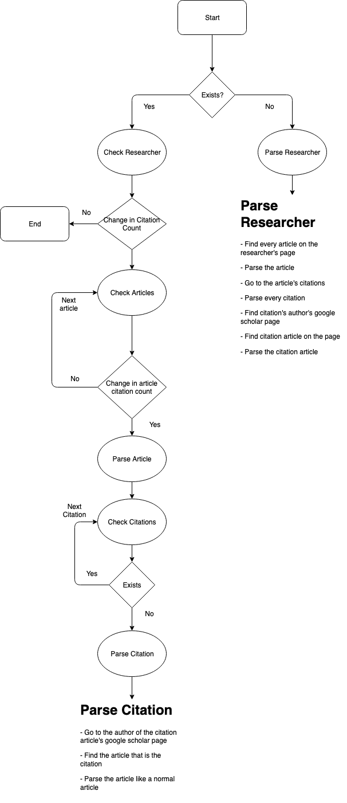

-> # Selenium Web Scraper <-

-> Python and Selenium scrapping google scholar <-

-----------------------

# Names to parse
- Irfan Ahmed
- Tomasz Arodz
- Eyuphan Bulut
- Alberto Cano
- Krzysztof Cios
- Robert Dahlberg
- Kostadin Damevski
- Thang Dinh
- Debra Duke
- Carol Fung
- Preetam Ghosh
- Vojislav Kecman
- Bartosz Krawczyk
- Lukasz Kurgan
- John D. Leonard II
- Changqing Luo
- Milos Manic
- Bridget McInnes
- Tamer Nadeem
- Tarynn Witten
- Cang Ye
- Hong-Sheng Zhou

---------------------

# Optimizations
* Download the html for a publication and parse that to allow for parallelization without the browser thinkings we're DOSing it
    * Using ScraPY or BeautifulSoup
* Email report to me of the changes since the last parse (python smtp library)
* Use configuration file

-------------------------------------

# To Parse
- **FROM SCHOLAR**

- [x] Total Citations
- [x] Publications IDs 

- **FROM PUBLICATIONS**

- [x] Publication ID
- [x] Date of publications
- [x] Number of citations
- [ ] Publication ID of citations
- [ ] Publication information of citations

----------------------------------

# Algorithm

## Build Database
```
Grab the total citations for each researcher
for each of their publications then
    Grab name, date of publishing, id

    for each citation of that publication then
        grab name, date of publish (citation date), and id
    end
end 
```

# State Diagram

